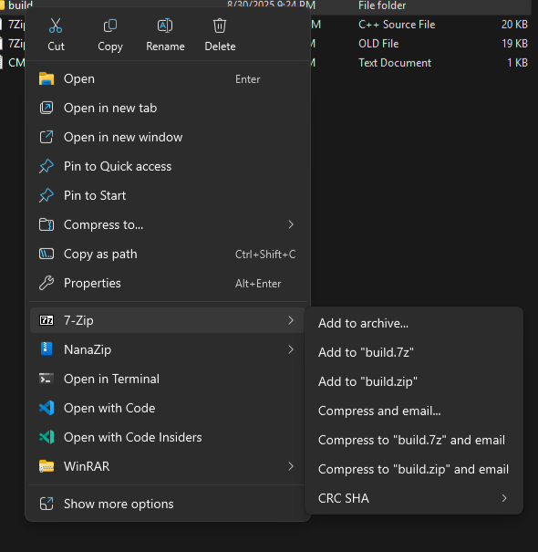

# 7-Zip Modern Context Menu Extension

A standalone Windows 11 **modern context menu extension** for [7-Zip](https://www.7-zip.org/), built with the `IExplorerCommand` interface and packaged with MSIX.  

This project is **not a full fork of 7-Zip** — it does not include the installer or core 7-Zip binaries.  
It is designed as a **companion** to an existing 7-Zip installation, adding a native Windows 11 style right-click menu similar to what NanaZip provides.  

---

## ✨ Features
- Full set of classic 7-Zip right-click menu commands:
  - **Open archive**, **Extract files…**, **Extract Here (Smart)**, **Extract to “<Folder>\\”**, **Add to archive…**, **Add to “<Name>.7z”**, **Add to “<Name>.zip”**, **Compress and email**, and CRC/SHA submenu.  
- **Smart Extract Here**: multiple archives extract into their own subfolders (avoids file mixing).  
- **Dynamic menu text**: e.g. `Add to "File.7z"`, `Extract to "Archive\\"`.  
- Root **“7-Zip” flyout** shows the 7-Zip icon; subcommands are clean text-only.  
- Works alongside the official 7-Zip install.  

---

## 📸 Screenshot

Here’s how the modern flyout looks in Explorer:  



*(Replace `docs/screenshot.png` with your actual screenshot path in the repo.)*

---

## 📦 Installation
1. Make sure you have [7-Zip](https://www.7-zip.org/) installed.  
2. Download the latest `.msix` package from [Releases](./releases).  
3. Double-click the `.msix` to install.  
   - If Windows blocks the install because the certificate is untrusted, install the included `.cer` into **Trusted People** (Local Machine).  

Once installed, right-click any file/folder in Explorer → the modern “7-Zip” flyout will appear.

---

## 🛠️ Building from Source (Optional)
The binaries are included, so most users don’t need this.  
For developers who want to compile:  

### Requirements
- Visual Studio 2022 with C++ Desktop Development tools  
- Windows 10/11 SDK  
- CMake  

### Build
```powershell
cmake -S . -B build
cmake --build build --config Release
```

The outputs will be in `build/Release/`.  

### Deploy (dev)
To register without packaging:  
```powershell
Add-AppxPackage .\AppxManifest.xml -Register -ExternalLocation "C:\Path\To\7-Zip"
```

---

## 📜 License
This project follows the [7-Zip License](https://www.7-zip.org/license.txt) for code derived from 7-Zip.  
